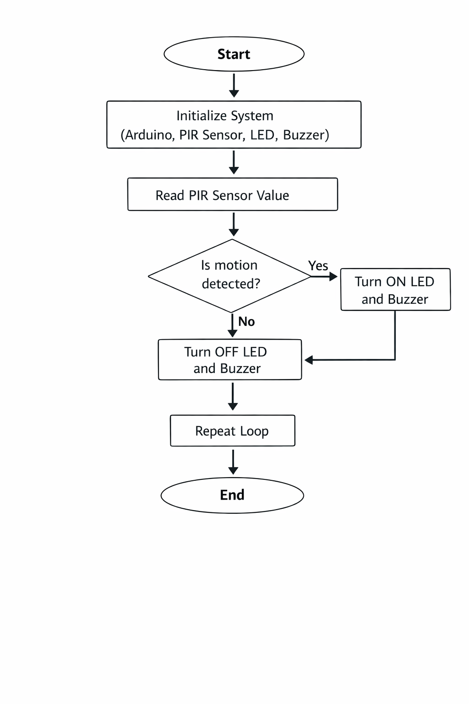

# 🔍 Motion Detection System (IoT Project)

## 📌 Overview
This project implements a simple and cost-effective **Motion Detection System** using Arduino. It detects human movement and provides real-time alerts using LEDs and a buzzer. The system is designed for basic security and automation applications.

---

## 🎯 Objectives
- Detect human motion using sensors  
- Provide visual alert using LED  
- Generate sound alert using buzzer  
- Reduce manual monitoring  
- Ensure low-cost and efficient system  
- Enable future IoT integration  

---

## ⚙️ Components Used
- Arduino Uno  
- PIR Sensor / Ultrasonic Sensor (HC-SR04)  
- LED (Red & Green)  
- Buzzer  
- Breadboard  
- Connecting Wires  

---

## 🧠 Working Principle
- Sensor continuously monitors surroundings  
- Detects motion / object presence  
- Sends signal to Arduino  
- Arduino processes input  
- LED & buzzer activate based on detection  

👉 If motion/object detected:
- LED ON 🔴  
- Buzzer ON 🔊  

👉 If no motion:
- LED OFF / Green ON 🟢  

---

## 🔄 Algorithm
1. Start system  
2. Initialize Arduino pins  
3. Read sensor input  
4. Check for motion/object  
5. If detected → Turn ON LED & buzzer  
6. Else → Turn OFF outputs  
7. Repeat continuously  

---

## 📊 Flowchart

---

## 🧪 Input
- Sensor detects motion / distance  
- Sends signal to Arduino  

---

## 📤 Output
- Red LED → Object detected / occupied  
- Green LED → No object / empty  
- Buzzer → Alert signal  

---

## 🏁 Conclusion
This project successfully demonstrates a **low-cost motion/parking detection system** using Arduino and sensors. It provides real-time detection and reduces manual monitoring. It is simple, efficient, and suitable for beginners.

---

## 🔮 Future Scope
- IoT integration (mobile alerts)  
- Multiple sensor support  
- Smart parking system  
- Wireless monitoring (WiFi/Bluetooth)  
- LCD display integration  

---

## 📚 References
- https://www.arduino.cc  
- https://www.electronics-tutorials.ws  
- HC-SR04 Datasheet  
- IEEE Research Papers  

---

## 📄 Project Report
👉 [Click here to view full PDF](IOT_CEP.pdf)

---

## 👨‍💻 Authors
- Sahil Khan  
- Jaswanth  

Under the guidance of  
**Ms. Baalne Anjali**
