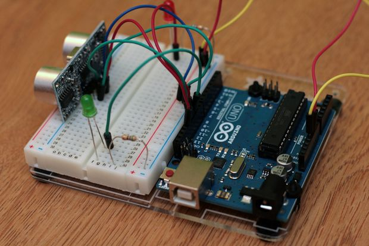

# Motion Detection System (IoT Project)

## 1. Overview

This project implements a motion detection system using Arduino. It detects human movement and provides real-time alerts using LED and buzzer. The system is simple, cost-effective, and suitable for basic security applications.

---

## 2. Objectives

1. To design a motion detection system using Arduino Uno
2. To detect human movement using sensors
3. To provide visual indication using LED
4. To generate alert using buzzer
5. To reduce manual monitoring
6. To ensure low-cost and efficient system
7. To enable future IoT integration

---

## 3. Components Used

* Arduino Uno
* PIR Sensor / Ultrasonic Sensor (HC-SR04)
* LED (Red and Green)
* Buzzer
* Breadboard
* Connecting wires

---

## 4. Working Principle

The system continuously monitors the surroundings using a sensor. When motion or an object is detected, the sensor sends a signal to the Arduino. The Arduino processes this input and activates the output devices.

If motion/object is detected:

* LED turns ON
* Buzzer activates

If no motion is detected:

* LED remains OFF or green LED indicates normal state

---

## 5. Algorithm

1. Start the system
2. Initialize Arduino pins
3. Read sensor input
4. Check for motion or object detection
5. If detected, turn ON LED and buzzer
6. Else, turn OFF output devices
7. Repeat continuously

---

## 6. Flowchart

---

## 7. Input

The input is provided by the sensor (PIR or ultrasonic), which detects motion or object presence and sends signals to the Arduino.

---

## 8. Output

The output is displayed using LEDs and buzzer:

* Red LED indicates detection
* Green LED indicates no detection
* Buzzer provides alert

---

## 9. Conclusion

The project demonstrates a simple and efficient motion detection system using Arduino and sensors. It reduces manual monitoring and provides real-time alerts. The system is low-cost and suitable for beginners.

---

## 10. Future Scope

1. Integration with IoT for remote monitoring
2. Support for multiple sensors
3. Smart parking system implementation
4. Wireless communication using WiFi or Bluetooth
5. Display integration using LCD

---

## 11. References

1. https://www.arduino.cc
2. https://www.electronics-tutorials.ws
3. HC-SR04 Datasheet
4. IEEE Research papers

---

## 12. Project Report

[View Full PDF](IOT_CEP.pdf)

---

## 13. Authors

* Sahil Khan
* Jaswanth

Guide:
Ms. Baalne Anjali
